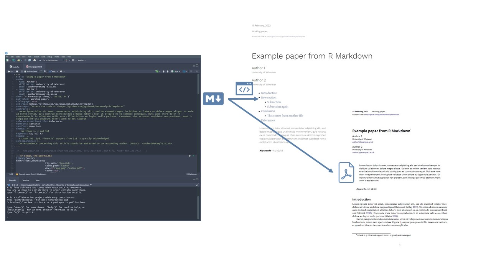

# Data Analysis Template: A reproducibility universe

This template is based on [Andrew Heiss'](https://www.andrewheiss.com/) [Global-Pandoc-Files](https://github.com/andrewheiss/Global-Pandoc-files) and [Portable Pandoc Magic](https://github.com/andrewheiss/portable-pandoc-magic) to convert Markdown-based documents into Word (docx through odt), HTML, and PDF (through xelatex).



## Project management
- [:file\_folder: tex_out](/tex_out): LaTeX support files 
- [:file\_folder: pandoc](/pandoc): (1) portable pandoc filters, (2) templates, (3) necessary fonts and (4) ad hoc scripts 
- [:file\_folder: scripts](/scripts): R scripts of the analysis - they are called in the preamble of the `rmd-paper.Rmd`. 
- [:file\_folder: sections](/sections): include all other (external) `.md` files necessary for the paper (e.g. `/sections/introduction.md` or `sections/conclusion.md`).


## Log of changes (relative to Andrew's portable version)
1. Added `pandoc-crossref.exe` in the project folder.
2. `pandoc/templates/xelatex.tex` and `pandoc/templates/xelatex-manuscript.tex` replace font `IncosoloataGo` with `Incosolata`.
3. Github repo includes `tex_out/rmd-paper.pdf`, but not any other supporting output files from `.tex`.

## Contents

- [Installation](#installation)
- [Usage](#usage)
- [Example](#example)
- [Miscellaneous](#miscellaneous)
  - [Including external files](#including-external-files)
  - [Blinding](#blinding)
  - [Version control](#version-control)
  - [&quot;Figure 1 here&quot;](#figure-1-here)
  - [PNG conversion](#png-conversion)
  - [Cross references and knitr/R Markdown](#cross-references-and-knitrr-markdown)


## Installation

You'll need to install these things:

- [**pandoc**](https://pandoc.org/MANUAL.html): Install either with `brew install pandoc` or by downloading it from [pandoc.org](https://pandoc.org/installing.html).
- [**make**](https://www.gnu.org/software/make/): The workhorse behind all the conversion is `make`, which uses this [`Makefile`](Makefile) to generate different pandoc incantations. On macOS, open Terminal and run `xcode-select --install` to install a handful of developer tools, including `make`. On Windows, [follow these instructions](https://stat545.com/make-windows.html).
- [**R**](https://cran.r-project.org/): Needed to convert [R Markdown](https://rmarkdown.rstudio.com/) files to Markdown (if you're using R Markdown). Also needed to get word count when you run `make count`. Download and install from [r-project.org](https://cran.r-project.org/). Ensure you have the following packages installed: [**tidyverse**](https://www.tidyverse.org/), [**knitr**](https://yihui.org/knitr/), [**rvest**](https://rvest.tidyverse.org/), and [**stringi**](http://www.gagolewski.com/software/stringi/) (run `install.packages(c("tidyverse", "knitr", "rvest", "stringi"))`)
- **Python 3**: Install either with `brew install python`  or by downloading it from [python.org](https://www.python.org/downloads/).
- **TeX**: If you want to do anything with PDFs, install LaTeX. It's easiest to just install the massive [MacTeX distribution](https://tug.org/mactex/) on macOS (or some Windows distribution if you use Windows).
- [**pandoc-include**](https://github.com/DCsunset/pandoc-include): Filter for inserting external Markdown files with syntax like `!include path/to/file.md`. Install with `pip install pandoc-include`.
- [**pandoc-citeproc**](https://github.com/jgm/pandoc-citeproc): Filter for dealing with bibliographies. Install with `brew install pandoc-citeproc`. It comes with pandoc if you install it from [pandoc.org](https://pandoc.org/installing.html).
- [**pandoc-crossref**](https://lierdakil.github.io/pandoc-crossref/): Filter for creating "Figure 1" and "Table 3" cross references. Install with `brew install pandoc-crossref`. Alternatively, export the `.exe` in the same folder of your project's directory.
- [**bibtool**](https://github.com/ge-ne/bibtool): Script for parsing and dealing with BibTeX files. Used for extracting cited references into a standalone `.bib` files when you run `make bib`. Install with `brew install bib-tool`.
- [**gawk**](https://www.gnu.org/software/gawk/):  The version of awk that comes with macOS by default doesn't work correctly with the script that inserts git commit information in the footer of PDFs. Install a more recent one with `brew install gawk`.
- [**LibreOffice**](https://www.libreoffice.org/): Open source clone of Microsoft Office. Used for converting `.odt` files to `.docx` when you run `make docx`. Install by [downloading their installer](https://www.libreoffice.org/download/download/).
- **Fonts**: There are a bunch of fonts included in the `pandoc/fonts/` folder. Install these as needed - ideally for all users. If not installed for all users, you may need to repeat this step in the future.

⚠️ This template is not fully portable. Some changes to specific to your computer directories are required.

## Usage
### STEP 1: Install the [Installation](#installation) items 
If done STEP 1 before, no need to repeat. Note that if you haven't installed the `pandoc/fonts` for all users, you may experience issues in compiling. In that case, you may reinstall the fonts.

### STEP 2:
1. Create a Markdown file (or R Markdown file) in some directory. Place `Makefile` and the [`pandoc`](pandoc/) folder in the same directory. If you're using a bibliography, include a BibTeX file in the same directory. The directory should look like this:

    ```text
    .
    ├── Makefile
    ├── manuscript.Rmd
    ├── references.bib
    ├── sections
        ├── introduction.md
        ├── conclusions.md
    ├── data
        ├── derived
        ├── manual
        ├── raw
    ├── scripts
    └── pandoc
        ├── bin
        ├── csl
        ├── fonts
        └── templates
    ```

2. Open `Makefile` and change the `SRC` and `BIB_FILE` variables to match your (R) Markdown file and BibTeX file names.

3. Change any of the other modifiable variables in `Makefile`; e.g. `ENDFLOAT` or `BLINDED`.

4. Use your `scripts/` to perform your empirical analysis in R (or any other software required). 

5. Save your data frames in `data/derived/` (as `.csv` or `.rds`) or store R objects as `.RData`. For the latter, see [here](https://bookdown.org/ndphillips/YaRrr/rdata-files.html). 

6. Write stuff in your (R) Markdown file. I recommend you make changes *only* to your `rmd-paper.Rmd`.

7. To convert from Markdown to something else, open a terminal window to your main directory and type `make html` or `make docx`, etc. Here are all the different things you can include after `make`:

    - `make md`: Convert R Markdown to regular Markdown
    - `make html`: Create HTML file
    - `make tex`: Create nice PDF through xelatex in `TEX_DIR` folder
    - `make mstex`: Create manuscripty PDF through xelatex in `TEX_DIR` folder
    - `make odt`: Create ODT file
    - `make docx`: Create Word file (through LibreOffice)
    - `make ms`: Create manuscripty ODT file
    - `make msdocx`: Create manuscripty Word file (through LibreOffice)
    - `make bib`: Extract bibliography references to a standalone `.bib` file
    - `make count`: Count the words in the manuscript
    - `make clean`: Remove all output files
    - `make all`: Creates all the files above 

    Through the magic of `make`, you can combine any of these, like `make html docx tex` or `make html msdocx mstex`, etc.

> `make tex` may need several times to run until it produces a `.pdf` without errors.

8. That's it! Write more, run `make SOMETHING` again, write more, run `make SOMETHING` again, and so on until you have a beautiful final document.


## Example

There are two complete minimal examples included in this repository: `md-paper.md` (regular Markdown) and `rmd-paper.Rmd` (R Markdown). Change the `SRC` variable to match one of their names, run `make SOMETHING`, and see what happens.

`rmd-paper.md` is generated from `rmd-paper.Rmd`. Only edit the `.Rmd` file, *not* the `.md` file.


## Miscellaneous

### Including external files

You can include other Markdown files (like tables generated from R, for instance) using the following syntax:

```text
!include path/to/file.md
```

### Blinding

If you set `BLINDED = TRUE` in the Makefile, a [Python script named `accecare.py`](https://github.com/andrewheiss/accecare) will run before compiling the document. Look at the CSV file in `pandoc/bin/replacements.csv` to see how to blind specific words and phrases. [See the documentation for `accecare.py` here](https://github.com/andrewheiss/accecare).

### Version control

If you set `VC_ENABLE = TRUE` in the Makefile, the current git commit will be included in the footer of your PDF *only* when running `make tex` (`make mstex` doesn't do this). Make sure you have a `git-repo` entry in your YAML front matter so that it can create a link to that commit at GitHub, GitLab, etc.

### "Figure 1 here"

You can move all the figures and tables to the end of the document by setting `ENDFLOAT = TRUE` in the Makefile. Some journals have this horribly backwards requirement ¯\\\_(ツ)\_/¯. This only happens when running `make mstex`; if you need all the figures and tables at the end of a Word file, you'll have to do it manually.

### PNG conversion

Word and HTML can choke on PDF images, so those targets use a helper script ([`pandoc/bin/replace_pdfs.py`](pandoc/bin/replace_pdfs.py)) to replace all references to PDFs with PNGs and—if needed—convert existing PDFs to PNG using `sips`. However, there are times when it's better to *not* convert to PNG on the fly, like when using high resolution PNGs exported from R with `ggsave()` and Cairo. To disable on-the-fly conversion and supply your own PNGs, use `PNG_CONVERT = --no-convert`. The script will still replace references to PDFs with PNGs, but will not convert the PDFs.

### Cross references and knitr/R Markdown

You can embed plots in documents automatically. BUT it does not play well with `pandoc-crossref`.

#### Cross-ref for figures
For `pandoc-crossref` to work, you have to use this syntax:

```text
Here is some text that refers to @fig:myfig.

{#fig:myfig}
```

There's unfortunately no way to get that `{#fig:myfig}` into the correct place in a knitted R Markdown document. A solution is to not use R/knitr to include figures. Instead you may create the figures elsewhere—either in a different R script, or in a chunk in the document—and then save them to disk as PDF or PNG (or both). Then, use standard Markdown + pandoc-crossref syntax (`{}`) to include them:

````text
```{r create-figure, echo=FALSE, warning=FALSE, error=FALSE}
library(ggplot)

plot1 <- ggplot(...)

ggsave("output/myfig.pdf", plot1,
       width = 5, height = 3, device = cairo_pdf)
ggsave("output/myfig.png", plot1,
       width = 5, height = 3, type = "cairo", dpi = 300)
```

Here is some text that refers to @fig:myfig.

{#fig:myfig}
````

#### Cross-ref for tables
You don't need to do this with tables, though. If you use `pandoc.table()` from the [**pander** library](https://www.r-project.org/nosvn/pandoc/pander.html), you can include the correct pandoc-crossref syntax in the table caption:

````text
```{r example-table, echo=FALSE, warning=FALSE, message=FALSE, results="asis"}
library(tibble)
library(magrittr)
library(pander)

tribble(
  ~Heading, ~`Other heading`,
  2, 3,
  5, 7,
  9, 1
) %>%
  pandoc.table(caption = "This is a table {#tbl:mytable}")
```
````

